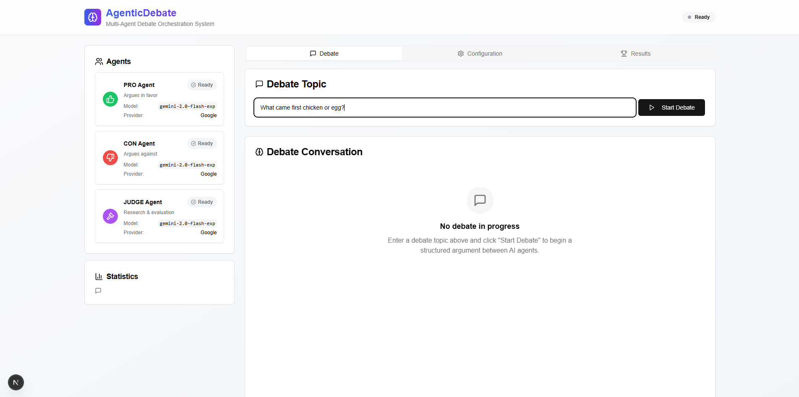
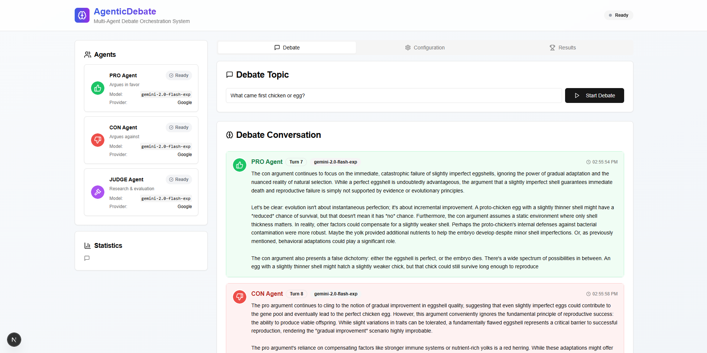

# AgenticDebate

A sophisticated multi-agent debate orchestration system that simulates structured debates between AI agents with research capabilities and impartial judging.




## 🧠 System Overview

AgenticDebate creates structured debates between three LLM agents:
- **PRO Agent**: Argues in favor of the topic
- **CON Agent**: Argues against the topic  
- **JUDGE Agent**: Researches the topic and evaluates the debate

### Key Features

- **Multi-Provider LLM Support**: Google Gemini, OpenAI, Anthropic, xAI, Groq
- **Web Search Integration**: DuckDuckGo, Tavily, SerpAPI for research
- **Structured Debate Flow**: Research → Debate → Judgment
- **Real-time Streaming**: Live updates via Server-Sent Events
- **Modern Web Interface**: React/Next.js frontend with configuration panel
- **Configurable Parameters**: Turn limits, time limits, model selection
- **Memory Management**: Full conversation history tracking
- **Multiple Interfaces**: Web UI, FastAPI server, and CLI

## 🚀 Quick Start

### Prerequisites

- Python 3.11+
- Node.js 18+
- npm or pnpm

### Installation

1. **Clone the repository**
   ```bash
   git clone https://github.com/TanayDI/Agentic-debate.git
   cd Agentic-debate
   ```

2. **Set up Python environment**
   ```bash
   python -m venv .venv
   
   # On Windows
   .venv\Scripts\activate
   
   # On macOS/Linux
   source .venv/bin/activate
   ```

3. **Install Python dependencies**
   ```bash
   pip install -r requirements.txt
   ```

4. **Install Node.js dependencies**
   ```bash
   npm install
   # or
   pnpm install
   ```

5. **Configure environment variables**
   ```bash
   cp .env.example .env
   ```
   
   Edit `.env` and add your API keys:
   ```env
   GOOGLE_API_KEY=your-gemini-api-key-here
   OPENAI_API_KEY=your-openai-api-key-here
   ANTHROPIC_API_KEY=your-anthropic-api-key-here
   XAI_API_KEY=your-xai-api-key-here
   GROQ_API_KEY=your-groq-api-key-here
   TAVILY_API_KEY=your-tavily-api-key-here
   SERPAPI_KEY=your-serpapi-key-here
   ```

### Running the Application

1. **Start the backend server**
   ```bash
   python main.py --mode api
   ```
   The FastAPI server will run on `http://localhost:8000`

2. **Start the frontend (in a new terminal)**
   ```bash
   npm run dev
   ```
   The web interface will be available at `http://localhost:3000`

3. **Access the application**
   - Open your browser to `http://localhost:3000`
   - Navigate to the Configuration tab to set up your preferences
   - Go to the Debate tab to start a new debate

## 🎯 How to Use

### Web Interface

1. **Configuration Setup**
   - Go to the Configuration tab
   - Set your API keys in the API Keys section
   - Configure agent models and parameters
   - Adjust debate settings (max turns, time limits)
   - Configure web search providers
   - Save your configuration

2. **Starting a Debate**
   - Navigate to the Debate tab
   - Enter a debate topic (e.g., "Should AI be regulated by governments?")
   - Click "Start Debate"
   - Watch real-time progress as agents research and debate

3. **Viewing Results**
   - Results appear automatically after debate completion
   - View detailed scores and reasoning
   - Access full conversation history
   - View debate statistics

### CLI Interface

Run a debate from the command line:
```bash
python main.py "Should renewable energy replace fossil fuels?" --max-turns 6 --max-time 1800
```

### Configuration Options

#### Agent Configuration
- **Model Selection**: Choose from supported LLM providers
- **Temperature**: Control creativity (0.0-1.0)
- **Max Tokens**: Set response length limits
- **Provider**: Select LLM provider (Google, OpenAI, Anthropic, etc.)

#### Debate Settings
- **Max Turns**: Maximum number of debate rounds (2-20)
- **Max Time**: Total debate duration in seconds (300-7200)
- **Turn Timeout**: Time limit per agent response (30-300 seconds)

#### Web Search Configuration
- **Provider**: Choose search provider (DuckDuckGo, Tavily, SerpAPI)
- **Max Results**: Number of search results to consider
- **Timeout**: Search request timeout

## 🔧 Configuration

### API Keys

The system supports multiple LLM providers. You need at least one API key:

- **Google Gemini**: Required for default configuration
- **OpenAI**: For GPT models
- **Anthropic**: For Claude models
- **xAI**: For Grok models
- **Groq**: For fast inference

### Web Search APIs

For enhanced research capabilities:
- **DuckDuckGo**: Free, no API key required
- **Tavily**: Requires API key, optimized for AI
- **SerpAPI**: Requires API key, Google search results

### Model Recommendations

- **Fast Debates**: Use Groq or Gemini 1.5 Flash
- **High Quality**: Use GPT-4, Claude 3.5 Sonnet, or Gemini 1.5 Pro
- **Balanced**: Use Gemini 1.5 Flash (default)

## 📁 Project Structure

```
debate-mirror-mcp/
├── agents/                 # Agent implementations
│   ├── base_agent.py      # Base agent class
│   ├── pro_agent.py       # Pro argument agent
│   ├── con_agent.py       # Con argument agent
│   └── judge_agent.py     # Judge evaluation agent
├── app/                   # Next.js frontend
│   ├── page.tsx           # Main application page
│   └── layout.tsx         # App layout
├── components/            # React components
│   ├── debate-interface.tsx
│   ├── configuration-panel.tsx
│   └── ui/                # UI components
├── config/                # Configuration files
│   ├── settings.py        # Python configuration
│   └── config.yaml        # Default settings
├── orchestrator/          # Debate orchestration
│   ├── debate_loop.py     # Main debate loop
│   ├── memory_manager.py  # Memory management
│   └── turn_manager.py    # Turn management
├── store/                 # Frontend state management
│   └── debate-store.ts    # Zustand store
├── tools/                 # External tools
│   └── web_search_tool.py # Web search integration
├── utils/                 # Utility functions
│   ├── llm_client.py      # LLM client wrapper
│   └── logger.py          # Logging utilities
└── main.py               # Application entry point
```

## 🔌 API Endpoints

### FastAPI Server

- `GET /`: Server status
- `POST /debate/stream`: Start streaming debate (SSE)
- `POST /debate`: Run debate (JSON response)

### WebSocket Support

Real-time updates via Server-Sent Events (SSE) for:
- Debate progress updates
- Agent responses
- Phase transitions
- Completion notifications

## 🛠️ Development

### Frontend Development

```bash
npm run dev        # Start development server
npm run build      # Build for production
npm run lint       # Run linting
```

### Backend Development

```bash
python main.py --mode api    # Start API server
python main.py --help        # View CLI options
```

### Testing

```bash
# Backend tests
python -m pytest

# Frontend tests
npm test
```

## 📊 Monitoring and Logging

- **Console Logging**: Real-time debug information
- **Web Interface**: Live debate progress
- **Error Handling**: Graceful failure handling
- **Performance**: Optimized for real-time streaming

## 🔒 Security

- **API Keys**: Stored locally, not transmitted
- **Environment Variables**: Sensitive data in .env
- **Git Ignore**: .env files excluded from version control
- **Input Validation**: Sanitized user inputs

## 🤝 Contributing

1. Fork the repository
2. Create a feature branch
3. Make your changes
4. Add tests if applicable
5. Submit a pull request

## 📝 License

This project is licensed under the MIT License - see the LICENSE file for details.

## 🙏 Acknowledgments

- Built with FastAPI and Next.js
- Powered by various LLM providers
- Web search integration via multiple APIs
- UI components from shadcn/ui

---

**Happy Debating! 🎭**
